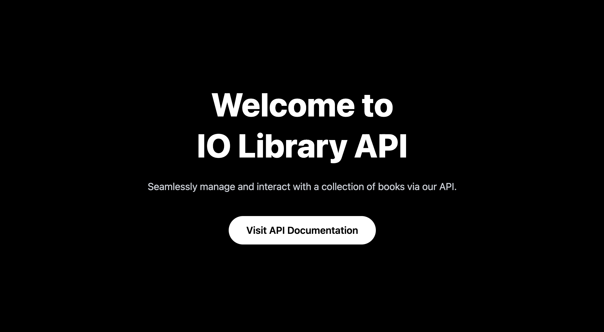
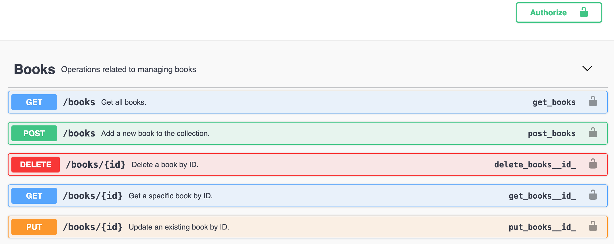

# Book Library API

A simple REST API for managing a library's book collection, built using Flask and deployed on AWS. This API allows users to manage a collection of books by adding, retrieving, and updating books in the system.
[](http://16.171.140.205/)
[](http://16.171.140.205/apidocs)

## Table of Contents

- [Overview](#overview)
- [Requirements](#requirements)
- [Installation](#installation)
- [API Endpoints](#api-endpoints)
- [Testing](#testing)
- [Deployment](#deployment)
- [Infrastructure as Code](#infrastructure-as-code)
- [Assumptions](#assumptions)
- [License](#license)

## Overview

This project is an API for managing books using Flask. It allows you to perform CRUD (Create, Read, Update, Delete) operations on a collection of books. The API is deployed on AWS using Terraform for infrastructure provisioning. PostgreSQL is used as the database to store book data.

### Key Features:

- **Deployed API**: The API is deployed and can be tested, [Click here to test the API](http://16.171.140.205/).
- **PostgreSQL Database**: A PostgreSQL database is used to store book information. PostgreSQL was chosen because of its robustness, scalability, and support for complex queries. It provides ACID compliance, ensuring data integrity and reliability. Its advanced features such as JSONB support, full-text search, and its ability to handle large datasets make it a suitable choice for this application.
- **Infrastructure as Code**: Terraform is used to provision AWS resources such as EC2 instances, IAM roles, and the PostgreSQL database.
- **Testing**: You can interact with the API using **Swagger UI** for an easy testing experience.

The project allows seamless deployment, integration, and testing of a book management API. You can create, retrieve, update, and delete books from the API, with data stored securely in a PostgreSQL database.

## Requirements

### Software Dependencies:

- Python 3.x
- Flask
- Flask-SQLAlchemy
- AWS CLI (for deployment)
- jq (for parsing JSON)
- more in the re quirements.txt

### Database:

- SQLite or PostgreSQL
- The deployed application api uses PostgreSQL Database (Superbase)

### API Key:

- The API is secured using a static API key (`X-API-Key` header).

### Optional (for deployment):

- AWS account with access to EC2, Secrets Manager, IAM roles.

---

## Installation

### 1. Clone the repository:

```bash
git clone https://github.com/phathwa/io-book-library.git
cd io-book-library
```

### 2. Install Dependencies

```bash
python3 -m venv .venv
source .venv/bin/activate
```

### 3. Set Up Virtual Environment

```bash
pip install -r requirements.txt
```

### 4. Set Environment Variables (Optional)

```bash
export FLASK_ENV=development
export API_KEY=your_api_key_here
export SQLALCHEMY_DATABASE_URI=your_database_uri_here
```

### 5. Run the Application

```bash
python main.py

```

The application will start on `http://127.0.0.1:80`.

---

## API Endpoints

### Authentication

```http
X-API-Key: your_api_key_here (default: fake-key)
```

### Endpoints

`GET /api/books`
Retrieve all books.

#### Response:

```json
[
  {
    "author": "Monde Phathwa",
    "created_at": "Sun, 24 Nov 2024 12:32:51 GMT",
    "id": 1,
    "isbn": "1234567890123",
    "publish_date": "2024-11-24",
    "title": "Trust Me, This Book Is Interesting",
    "updated_at": "Sun, 24 Nov 2024 12:32:51 GMT"
  }
]
```

---

`GET /api/books`
Retrieve all books.

#### Body:

```json
{
  "title": "Book Title",
  "author": "Author Name",
  "isbn": "1234567890123",
  "publish_date": "2024-01-01"
}
```

#### Response:

```json
{
  "id": 1,
  "message": "Book created successfully."
}
```

---

`DELETE /api/books/<id>`
Delete a book by ID

#### Response:

```json
{
  "id": 1,
  "message": "Book deleted successfully."
}
```

---

`PUT /api/books/<id>`
Update an existing book by ID

#### Response:

```json
{
  "id": 1,
  "message": "Book updated successfully"
}
```

---

## Running Tests

Unit tests are included to validate API functionality. To run the tests, use the following command:

```bash
python -m unittest discover -v
```

### Test Coverage

- POST /api/books: Add new books.
- GET /api/books: Retrieve all books.
- PUT /api/books/<id>: Update a book.
- DELETE /api/books/<id>: Delete a book.
- Edge cases:
  - Adding a book with invalid data.
  - Fetching books when the database is empty.
  - Invalid authentication.

---

## Deployment

The application is designed for deployment in an AWS environment. The following steps will guide you through deploying the API using **Terraform**.

### Prerequisites

Before deploying the API, make sure you have the following:

- An **AWS account**.
- **Terraform** installed on your local machine.
- **AWS CLI** configured with appropriate access credentials.
- A **PostgreSQL database** can be hosted anywhere (api connects using uri).
- An **AWS Secrets Manager secret** named `io-library-secrets` with the following structure:
  ```json
  {
    "x-api-key": "your_api_key_here",
    "database-uri": "your_database_uri_here"
  }
  ```
- Example: create secret key using aws CLI:
  ```
  aws secretsmanager create-secret \
      --name io-library-secrets \
      --description "Secrets for IO Book Library API" \
      --secret-string '{
          "x-api-key": "your_api_key_here",
          "database-uri": "your_database_uri_here"
      }'
  ```

### Run Terraform Commands:

After setting up the prerequisites (including the region in variables.tf), you can deploy the API by running the following commands:

```bash
# Destroy any existing infrastructure
terraform destroy -auto-approve

# Initialize Terraform
terraform init

# Validate the configuration files
terraform validate

# Plan the deployment to see the changes
terraform plan

# Apply the changes to provision the infrastructure
terraform apply -auto-approve

```

#### OR: while inside the the `'terraform/'` directory:

```bash
source ./scripts/terra_run_deploy.sh
```

---

## Testing the API using Swagger UI

Swagger UI provides an interactive interface that allows you to easily test the API endpoints. Here’s how you can test the API using Swagger UI:

1. **Access the Swagger UI Interface:**
   - Open your web browser and navigate to the following URL:  
     http://<public_ip>/docs (NOT https)
     - Replace `<public_ip>` with the actual public IP address of your deployed API.
     - Example: [http://16.171.140.205/apidocs](http://16.171.140.205/apidocs)
2. **Explore the API Endpoints:**

   - Once the Swagger UI loads, you will see a list of all available API endpoints.
   - Each endpoint will show its method (GET, POST, PUT, DELETE), a description, and parameters.

3. **Test the Endpoints:**
   - To test an endpoint, click on the method (e.g., `GET /api/books`).
   - Fill in any required parameters (like the book data for POST requests), and click on the "Try it out!" button.
   - Swagger UI will display the response, including the HTTP status code and the returned data (if any).
4. **Authentication:**

   - Some endpoints may require an API key for authentication. You can include the API key in the `X-API-Key` header. This header is necessary for secure access to the API.
   - To add the `X-API-Key` header, click on the "Authorize" button in the Swagger UI, then input the API key.

5. **Check Responses:**
   - After testing, you will see responses from the API directly in the Swagger UI.
   - This allows you to verify if the API is working as expected and return the correct data.

By following these steps, you can interactively test the API and ensure it functions properly before using it in your application.

## License

This project is licensed under the MIT License. See the LICENSE file for details.

## Contact

For questions, please contact Monde Phathwa on phathwa@gmail.com

---

### Changes/Additions:

1. **PUT and DELETE Documentation**:
   Added sections describing `PUT` and `DELETE` endpoints with example request/response data.
2. **Test Coverage**:
   Documented the scope of unit tests, including edge cases.
3. **Deployment**:
   Highlighted AWS-specific configurations and how they work with the application.
4. **General Improvements**:
   Updated the structure to make the file more comprehensive and easier to read.
